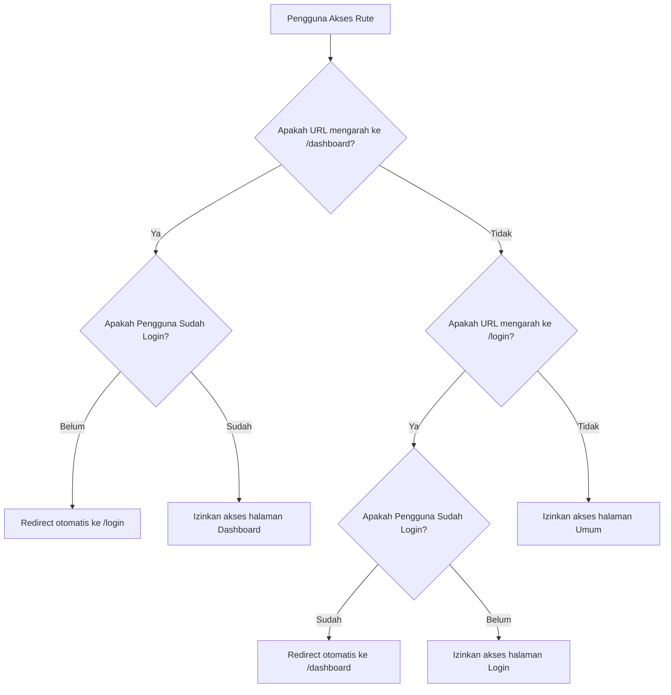

# 🛍️ e-storea
//tugas
> **e-storea** adalah proyek *starter template* e-commerce modern yang dirancang untuk performa tinggi, keamanan optimal, dan pengalaman pengembang (*developer experience*) yang luar biasa. Dibangun menggunakan teknologi web termutakhir seperti **Next.js**, **React 19**, **Tailwind CSS v4**, **TypeScript**, dan **NextAuth.js v5**.

---

## 🚀 Teknologi Utama

Proyek ini memanfaatkan keunggulan ekosistem React modern untuk menghadirkan aplikasi web berstandar industri:

| Teknologi | Versi | Peran Utama |
| :--- | :---: | :--- |
| **Next.js (App Router)** | `16.2.6` | Framework React, Server-Side Rendering (SSR), API Routes, & Server Actions |
| **React** | `19.2.4` | Server & Client Components modern, Hooks optimasi terbaru |
| **Tailwind CSS** | `^4.0.0` | Styling premium super cepat dengan mesin kompilasi CSS *v4* terbaru |
| **NextAuth.js** | `v5 (Beta)` | Solusi autentikasi modern berbasis *edge-ready session management* |
| **TypeScript** | `^5.0.0` | Menjamin keandalan kode dengan *strict type safety* |

---

## ✨ Fitur Unggulan

*   🔐 **Autentikasi Ganda Terintegrasi**
    *   **Google OAuth**: Login instan sekali klik yang aman menggunakan akun Google.
    *   **Credentials Provider**: Login fleksibel berbasis email dan password yang terhubung ke database.
*   🛡️ **Proteksi Halaman Cerdas (Next.js Middleware)**
    *   Membatasi akses rute `/dashboard` hanya untuk pengguna yang sudah terautentikasi.
    *   Mencegah pengguna yang sudah login untuk mengakses kembali halaman `/login` dengan redirect otomatis.
*   ⚡ **Tailwind CSS v4 Terintegrasi**
    *   Mengadopsi rilis Tailwind CSS v4 terbaru yang menggunakan arsitektur modular murni CSS tanpa berkas konfigurasi JavaScript tambahan yang rumit (`@import "tailwindcss"`).
*   🌐 **Server Actions Modern**
    *   Menggunakan pemanggilan fungsi server-side secara langsung dari elemen form HTML (`"use server"`) untuk interaksi data yang efisien dan aman.

---

## 📂 Struktur Direktori Proyek

Berikut adalah gambaran umum berkas dan direktori penting di dalam proyek **e-storea**:

```text
e-storea/
├── app/                      # Direktori Next.js App Router
│   ├── api/
│   │   └── auth/             # API Route handler untuk NextAuth
│   │       └── [...nextauth]/
│   │           └── route.ts  # Endpoint integrasi autentikasi
│   ├── favicon.ico
│   ├── globals.css           # Konfigurasi global CSS & Token Tailwind v4
│   ├── layout.tsx            # Layout utama aplikasi
│   └── page.tsx              # Halaman Login utama (Google & Credentials)
├── public/                   # Aset statis (gambar, SVG, dll)
├── auth.ts                   # Konfigurasi NextAuth (Providers, Callbacks, Pages)
├── middleware.ts             # Proteksi rute & intercept request navigasi
├── next.config.ts            # Konfigurasi build & optimasi Next.js
├── package.json              # Daftar pustaka dependensi & skrip proyek
└── tsconfig.json             # Pengaturan kompilator TypeScript
```

---

## 🛠️ Panduan Instalasi & Penggunaan

### 1. Prasyarat
Pastikan Anda sudah menginstal alat-alat berikut di perangkat Anda:
*   [Node.js](https://nodejs.org/) (Sangat direkomendasikan versi **v18+** atau **v20+**)
*   Package Manager seperti **npm** (bawaan Node.js), **pnpm**, atau **yarn**.

### 2. Kloning Proyek & Instal Dependensi
Jalankan perintah berikut di terminal Anda untuk mengunduh proyek dan menginstal seluruh pustaka yang diperlukan:

```bash
# Masuk ke direktori proyek
cd e-storea

# Instal dependensi menggunakan npm
npm install
```

### 3. Konfigurasi Environment Variables
Buat berkas bernama **`.env.local`** pada direktori utama proyek, lalu tambahkan variabel berikut:

```env
# Kunci enkripsi untuk token sesi NextAuth (Anda dapat membuat kunci acak baru)
AUTH_SECRET=ets jangan dispill

# Konfigurasi Google OAuth Credentials (dapatkan dari Google Cloud Console)
AUTH_GOOGLE_ID=xxx
AUTH_GOOGLE_SECRET=xxx
```

> 💡 **Tips Keamanan**: Jangan pernah membagikan berkas `.env.local` Anda ke GitHub atau layanan hosting publik lainnya.

### 4. Jalankan Server Pengembangan
Untuk mulai menjalankan proyek dalam mode pengembangan lokal (*local development*):

```bash
npm run dev
```

Setelah server berhasil dijalankan, buka peramban (*browser*) Anda dan akses halaman:
👉 **[http://localhost:3000](http://localhost:3000)**

---

## 🔒 Alur Kerja Autentikasi & Proteksi Rute

Proyek ini telah dikonfigurasi dengan alur proteksi rute otomatis yang canggih menggunakan **Middleware Next.js** yang terletak pada berkas [`middleware.ts`](file:///c:/Users/mazka/e-storea/middleware.ts):



Seluruh mekanisme validasi sesi ini diatur secara efisien tanpa memerlukan render dari sisi klien terlebih dahulu (*edge middleware validation*).

---

## 🛠️ Perintah Pengembangan (Scripts)

| Perintah | Deskripsi |
| :--- | :--- |
| `npm run dev` | Menjalankan server lokal Next.js untuk tahap pengembangan. |
| `npm run build` | Melakukan proses build optimal dan kompilasi proyek untuk siap digunakan di server produksi. |
| `npm run start` | Menjalankan server Next.js mode produksi (setelah melakukan perintah `build`). |
| `npm run lint` | Menganalisis kode proyek menggunakan ESLint untuk memastikan kerapian dan kualitas kode. |

---

## 🤝 Kontribusi

Kontribusi selalu terbuka untuk pengembangan yang lebih baik! Jika Anda menemukan kendala atau ingin menambahkan fitur baru, silakan buka *Issue* baru atau ajukan *Pull Request* di repositori proyek ini.

---

## 📄 Lisensi

Proyek ini dilisensikan di bawah lisensi **MIT**. Anda bebas menggunakan, memodifikasi, dan mendistribusikan proyek ini untuk kebutuhan komersial maupun non-komersial.
